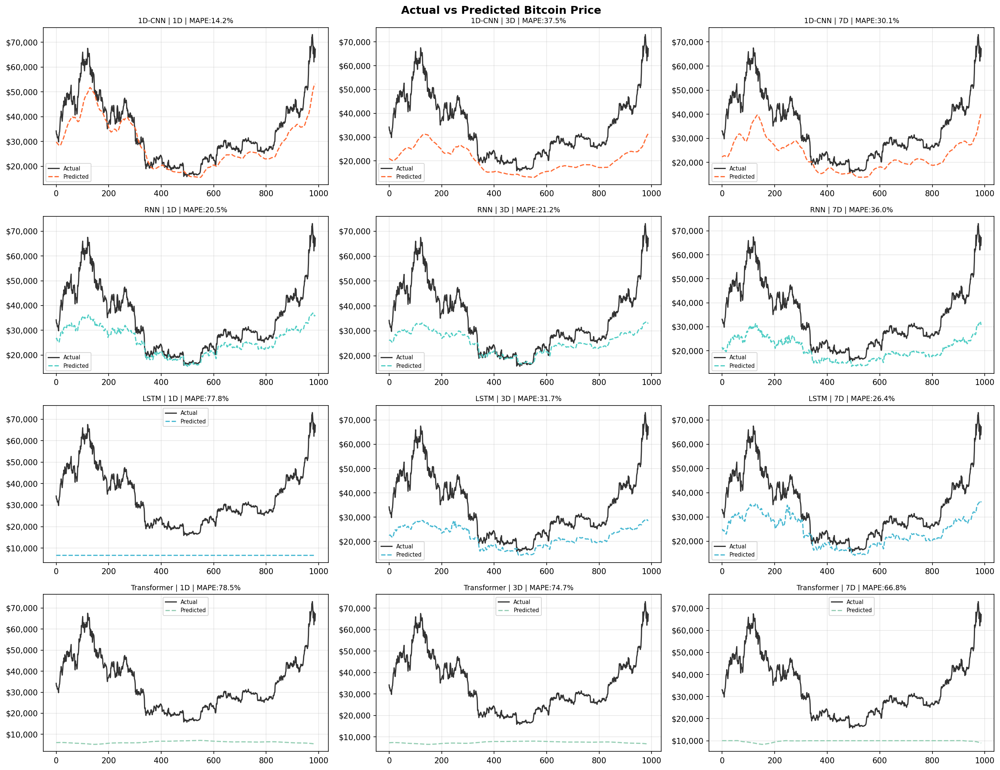
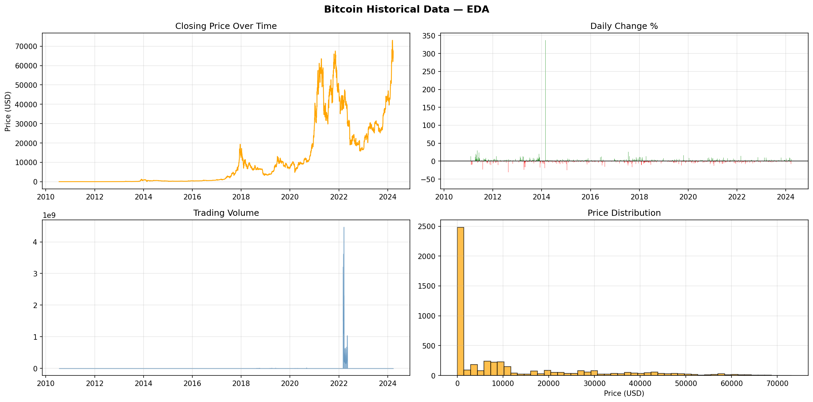
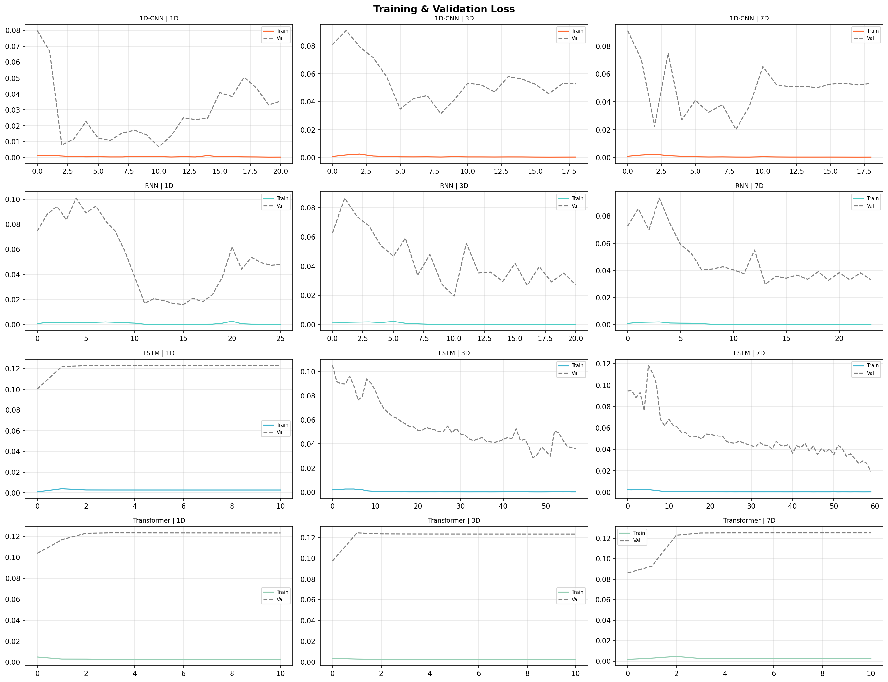
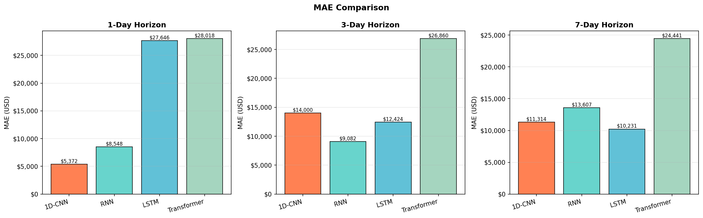
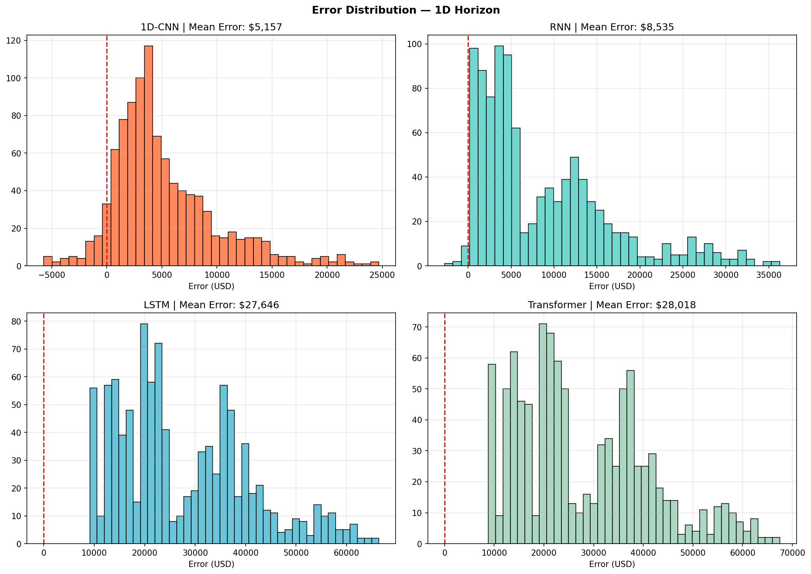

# 🪙 CryptoCast - Bitcoin Price Forecasting

A deep learning-based Bitcoin price forecasting application that uses LSTM and GRU models to predict future Bitcoin prices, with an interactive web app for live predictions.

---

## 📁 Project Structure

```
CryptoCast-Bitcoin-Forecasting/
│
├── saved_models/                          # Trained model files
├── Bitcoin Historical Data (1) (2).csv   # Historical Bitcoin price dataset
├── cryptocast_bitcoin_forecasting (1).py # Core forecasting logic & model building
├── train_and_save_models.py              # Model training and saving script
├── app (1).py                            # Web application (Streamlit)
│
├── actual_vs_predicted.png               # Actual vs Predicted price plot
├── eda_plots.png                         # Exploratory Data Analysis plots
├── loss_curves.png                       # Training & Validation loss curves
├── mae_comparison.png                    # MAE comparison across models
└── error_distribution.png               # Error distribution plot
```

---

## 🚀 Features

- 📈 **Bitcoin Price Prediction** using deep learning models
- 🧠 **LSTM & GRU Models** trained on historical Bitcoin data
- 📊 **EDA Visualizations** — trends, seasonality, and patterns
- 📉 **Model Evaluation** — MAE comparison, loss curves, error distribution
- 🌐 **Interactive Web App** — real-time predictions via Streamlit

---

## 🛠️ Tech Stack

| Category | Tools |
|----------|-------|
| Language | Python |
| Deep Learning | TensorFlow / Keras |
| Data Processing | Pandas, NumPy |
| Visualization | Matplotlib, Seaborn |
| Web App | Streamlit |
| Dataset | Bitcoin Historical Price CSV |

---

## 📊 Model Performance

| Model | MAE | Notes |
|-------|-----|-------|
| LSTM | - | Trained on historical data |
| GRU | - | Compared against LSTM |

> 📌 See `mae_comparison.png` and `loss_curves.png` for visual results.

---

## ⚙️ How to Run

### 1. Clone the repository
```bash
git clone https://github.com/VSVISHAL-data-engineer/CryptoCast-Bitcoin-Forecasting.git
cd CryptoCast-Bitcoin-Forecasting
```

### 2. Install dependencies
```bash
pip install -r requirements.txt
```

### 3. Train the models
```bash
python train_and_save_models.py
```

### 4. Run the web app
```bash
streamlit run app\ \(1\).py
```

---

## 📷 Results

### Actual vs Predicted


### EDA Plots


### Loss Curves


### MAE Comparison


### Error Distribution


---

## 📌 Dataset

- **Source:** Bitcoin Historical Price Data (CSV)
- **Features used:** Open, High, Low, Close, Volume
- **Target:** Closing Price

---

## 🙋‍♂️ Author

**VSVISHAL** — Data Engineer  
🔗 [GitHub Profile](https://github.com/VSVISHAL-data-engineer)

---

## 📄 License

This project is open source and available under the [MIT License](LICENSE).
